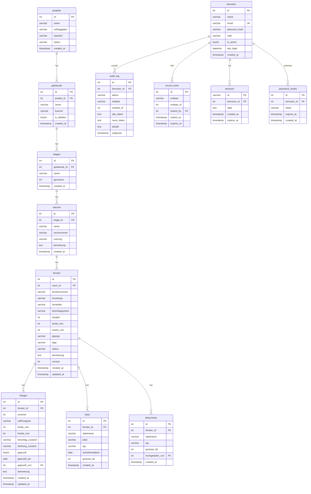

# Entity-Relationship-Diagramm

## Diagramm (Mermaid)



## Beziehungen (Kardinalitäten)

| Von | Zu | Beziehung | FK-Feld | Kaskade |
|-----|-----|-----------|---------|---------|
| projekte | gebaeude | 1:n | gebaeude.projekt_id | Soft-Delete |
| gebaeude | etagen | 1:n | etagen.gebaeude_id | CASCADE |
| etagen | raeume | 1:n | raeume.etage_id | CASCADE |
| raeume | fenster | 1:n | fenster.raum_id | CASCADE |
| fenster | fluegel | 1:n | fluegel.fenster_id | CASCADE |
| fenster | fotos | 1:n | fotos.fenster_id | CASCADE |
| fenster | dokumente | 1:n | dokumente.fenster_id | SET NULL |
| benutzer | audit_log | 1:n | audit_log.benutzer_id | SET NULL |
| benutzer | record_locks | 1:n | record_locks.locked_by | CASCADE |
| benutzer | fluegel | 1:n | fluegel.geprueft_von | SET NULL |

## Hierarchie-Tiefe

```
Projekt (1)
  └── Gebäude (n)
        └── Etage (n)
              └── Raum (n)
                    └── Fenster (n)
                          ├── Flügel (n)
                          ├── Fotos (n)
                          └── Dokumente (n)
```

## Indizes

| Tabelle | Index | Spalten | Typ |
|---------|-------|---------|-----|
| benutzer | email | email | UNIQUE |
| fenster | idx_raum | raum_id | INDEX |
| fenster | idx_status | status | INDEX |
| fenster | idx_fensternummer | fensternummer | INDEX |
| fluegel | idx_fenster | fenster_id | INDEX |
| fotos | idx_fenster | fenster_id | INDEX |
| raeume | idx_etage | etage_id | INDEX |
| etagen | idx_gebaeude | gebaeude_id | INDEX |
| audit_log | idx_zeitpunkt | zeitpunkt | INDEX |
| audit_log | idx_entitaet | entitaet, entitaet_id | INDEX |
| record_locks | idx_lock | entitaet, entitaet_id | UNIQUE |

---

*Erstellt: 2025-07-26*
